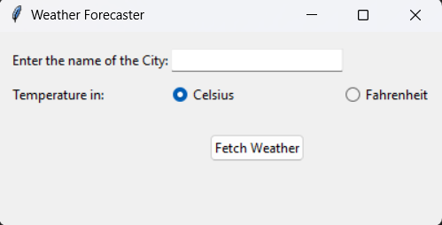

## Weather Forecaster Application 🌦

## Details
Fetch and view weather conditions for any city right from a user-friendly GUI.

## Prerequisites 📋

-Python
-requests module
-Install the required Python module with: pip install requests

## Features 🌟

🌡 Fetch current weather conditions.
📅 Forecast for upcoming days.
🌀 Storm alerts based on conditions.
🔧 Choose between Celsius or Fahrenheit.

## Quick Start 🚀

1. Clone and Navigate: git clone https://github.com/Bisalkumar/Weather_Forecaster.git
2. cd weather_forecaster
3. Run the App: python weather_app.py

## Usage 🎯

1. Input City: Type the name of the city.
2. Choose Units: Select Celsius or Fahrenheit.
3. Get Weather: Click on "Fetch Weather" to view the conditions.

## Screenshots 📸

### Contributions
Contributions are welcome! Please read the CONTRIBUTING.md file for more details on how to contribute to this project.

### License
This project is licensed under the MIT License - see the LICENSE.md file for details.

### Acknowledgement
-Special thanks to tinkter for their comprehensive gui library.
-Appreciation to all contributors and testers for making this better.
